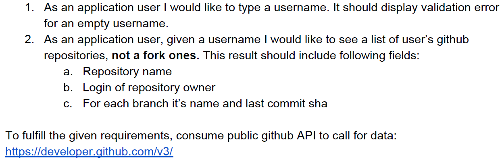

# Github user repository explorer app

## Motivation

The project was created as the task in the recruitment process for the position of front-end developer within 48h.

## User story

## Open API Generator

Files in directory `src/api/github-client/*` are genereted using [@openapitools/openapi-generator-cli](https://www.npmjs.com/package/@openapitools/openapi-generator-cli) based on [GitHub API description](https://github.com/github/rest-api-description/blob/main/descriptions/ghes-3.9/ghes-3.9.2022-11-28.json).
